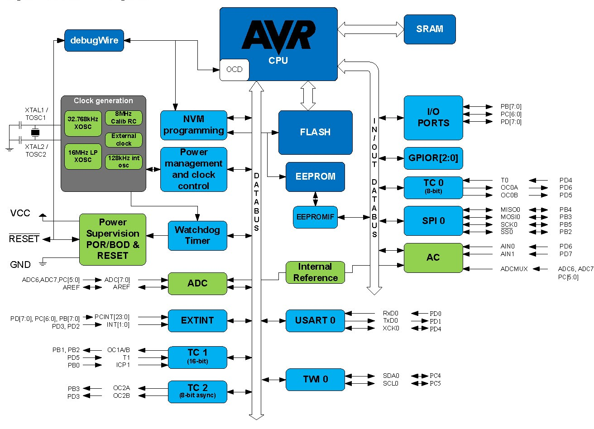

# Embedded C 

#### Introduction:

A microcontroller (MCU for microcontroller unit) is a small computer on a single metal-oxide-semiconductor (MOS) integrated circuit (IC) chip. A microcontroller contains one or more CPUs (processor cores) along with memory and programmable input/output peripherals. Program memory in the form of ferroelectric RAM, NOR flash or OTP ROM is also often included on chip, as well as a small amount of RAM. Microcontrollers are designed for embedded applications, in contrast to the microprocessors used in personal computers or other general purpose applications consisting of various discrete chips.

In modern terminology, a microcontroller is similar to, but less sophisticated than, a system on a chip . SoC may include a microcontroller as one of its components, but usually integrates it with advanced peripherals like graphics processing unit (GPU), Wi-Fi module, or one or more coprocessors.

Microcontrollers are used in automatically controlled products and devices, such as automobile engine control systems, implantable medical devices, remote controls, office machines, appliances, power tools, toys and other embedded systems. By reducing the size and cost compared to a design that uses a separate microprocessor, memory, and input/output devices, microcontrollers make it economical to digitally control even more devices and processes. Mixed signal microcontrollers are common, integrating analog components needed to control non-digital electronic systems. In the context of the internet of things, microcontrollers are an economical and popular means of data collection, sensing and actuating the physical world as edge devices.

Some microcontrollers may use four-bit words and operate at frequencies as low as 4 kHz for low power consumption (single-digit milliwatts or microwatts). They generally have the ability to retain functionality while waiting for an event such as a button press or other interrupt; power consumption while sleeping (CPU clock and most peripherals off) may be just nanowatts, making many of them well suited for long lasting battery applications. Other microcontrollers may serve performance-critical roles, where they may need to act more like a digital signal processor (DSP), with higher clock speeds and power consumption.

ATmega328P is one of the high performances AVR technology microcontroller with a large number of pins and features. It is designed by 8-bit CMOS technology and RSIC CPU which enhance its performance and its power efficiency get improved by auto sleeps and internal temperature sensor. This ATmega328P IC comes with internal protections and multiple programming methods which helps the engineers to priorities this controller for different situations. The IC allows multiple modern era communications methods for other modules and microcontrollers itself, which is why the microcontroller ATmega328P usage has been increasing every day.

#### CI and Code Quality
|Build|Cppcheck|Codacy|
|:--:|:--:|:--:|
||||

# ACTIVITY_1
### LED_STATUS
(Simulation_Images/PIC1.png)
(Simulation_Images/PIC2.png)
(Simulation_Images/PIC3.png)
(Simulation_Images/PIC4.png)

# ACTIVITY_2
(Simulation_Images/ACT_2.png)

# ACTIVITY_3
(Simulation_Images/ACT_3.png)

# ACTIVITY_4
(Simulation_Images/ACT_4.png)

